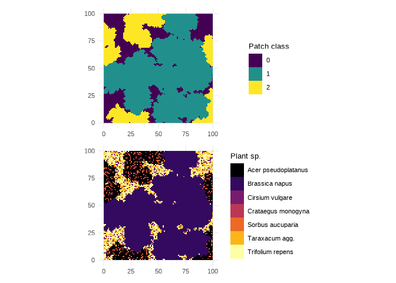
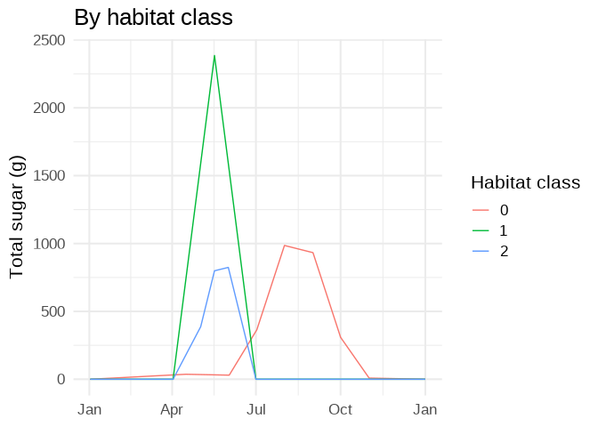
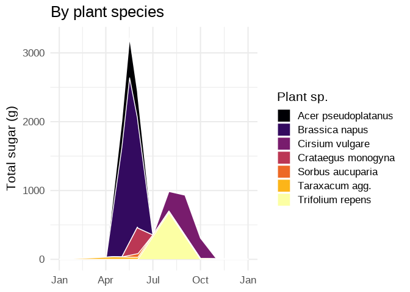

<!-- badges: start -->

<!-- badges: end -->

## Overview

Together, flowering plants and flower-visiting animals account for about
1/3 of all described extant species of eukaryotic life on Earth. The
trophic interface between flowers and florivores is, therefore, one of
the chief foundations of global biodiversity, and patterns of floral
resource availability can be expected to govern abundance, diversity,
and functional relationships at higher trophic levels. **sweetworld** is
a sandbox for exploring landscape-scale patterns of floral resource
availability arising from simulated floral communities.

<!--  -->

## Installation

`devtools::install_github("sponslerdb/floralcurves")`

## 1. Generate landscape

Landscape are generated with the function `landgen()`, which serves as a
wrapper for functions in the package `landscapeR` (Masante 2017). At
present, the function is hardcoded to produce a 3-class landscape
(e.g. crop, forest, herbaceous), but I plan to make this more flexible
in later versions of the package.

The following code produces a 100 x 100 cell raster (`area = 10000`); if
each cell is taken to represent 1 m2, the result is a one
hectare landscape. Class 0 represents the background matrix on which
patches of class 1 and class 2 are generated. The proportional abundance
of classes 1 and 2 are controlled by `prop1` and `prop2`, respectively,
with the proportional abundance of class 0 equal to 1 - (`prop1` +
`prop2`). The grain size of the landscape is controlled by `n1` and
`n2`, which determine the number of patches over which the total area of
class 1 and class 2 are distributed. Note that patches can become
contiguous.

    land1 <- landgen(area = 10000, 
                     prop1 = 0.6, 
                     prop2 = 0.2, 
                     n1 = 10, 
                     n2 = 10) 

## 2. Tabulate landscape

The next step is to tabulate the raster generated by `landgen`, simulate
a floral community, and join that floral community to a table of floral
traits. These steps are done by `landtab`.

Flora are assigned to landscape cells using the arguments `comp0`,
`comp1`, and `comp2`, which control the floral composition of habitat
classes 0, 1, and 2, respectively. In the simplest case, each habitat
class could be assigned a single floral species. In most cases, though,
we probably want to assign multiple species to one or more of the
classes. In the code below, habitat class 1 is simulated as pure
*Brassica napus*, representing oilseed rape fields, but classes 0
(representing non-crop herbaceous habitat) and 1 (representing forest)
are assigned multiple species. If a habitat class is assigned multiple
species, each landscape cell is assigned a single species drawn randomly
from the vector of species assigned to the class to which it belongs.
The relative abundance of each species within each class is controlled
by the arguments `prob0`, `prob1`, and `prob2`, each of which consists
of a vector of weights that govern the random sampling process. For ease
of interpretation, these weights should sum to 1, but the base `R`
function `sample()` that works behind the scenes of `landtab` will
accept any vector of weights and automatically rescale them.

Once a plant species has been assigned to each cell of the landscape
(now formatted as a row in a data table), we can add floral traits from
a table specified by `traitTab`. Of course, one’s choice of plant
species above has to correspond to species present in the trait table.
At minimum, this table must include the following traits:

1.  Plant name (the name of this column can vary — see `plantNames`
    argument)
2.  `flower.density.peak` (flowers per square meter at peak bloom)
3.  `bloom.start` (end of bloom, day of year)
4.  `bloom.end` (end of bloom, day of year)
5.  `bloom.peak` (end of bloom, day of year)
6.  `sugar.per.flower` (micrograms of suger per flower per day)

In this case, our trait table is `baude_traits` (shipped with the
package), which is a modification of the trait table provided by Baude
et al. (2016) (Supplemental Table 11). In addition to the required
traits listed above, `baude_traits` includes a handful of functional
traits that can be used to parse floral resource availability in
ecologically meaningful ways. The argument `plantNames` simply gives the
name of the column in the trait table that contains the plant names.

    land1_tab <- landtab(land1, 
                         comp0 = c("Cirsium vulgare", "Trifolium repens", "Taraxacum agg."),
                         comp1 = c("Brassica napus"),
                         comp2 = c("Acer pseudoplatanus", "Crataegus monogyna", "Sorbus aucuparia"),
                         prob0 = c(0.2, 0.5, 0.3),
                         prob1 = c(1),
                         prob2 = c(0.8, 0.1, 0.1),
                         traitTab = baude_traits,
                         plantNames = "name.latin")

At this point, let’s pause and appreciate the beautiful world we’ve
simulated.

    # Classes
    plot1 <- ggplot(land1_tab, aes(x, y, fill = class)) +
      geom_raster() +
      theme_minimal(16) +
      scale_fill_viridis_d() +
      labs(fill = "Patch class", x = NULL, y = NULL) +
      coord_fixed()

    # Plants
    plot2 <- ggplot(land1_tab, aes(x, y, fill = plant)) +
      geom_raster() +
      theme_minimal(16) +
      scale_fill_viridis_d(option = "inferno") +
      labs(fill = "Plant sp.", x = NULL, y = NULL) +
      coord_fixed()

    plot1 / plot2

## 3. Extend landscape through time

Now that we have simulated our floral communities in terms of
composition, we need to vary the floral density of each plant species
through time according to a function representing its phenology. This is
the job of `landpheno`. First, it takes the tabulated landscape and
performs a crossing join with a vector of time steps defined by the
arguments `first` and `last`. By default, these take the values of 0
(Jan 1) and 364 (Dec 31), generating a time series representing daily
intervals for one year. Then, it calculates a triangular density
function (Carnell 2019) for each plant species using `bloom.start`,
`bloom.peak`, and `bloom.end`. At `bloom.peak`, the function equals 1,
and it declines linearly to 0 as it approach `bloom.start` and
`bloom.end`. The value of this function is then multiplied by
`flower.density.peak` for each plant species to calculate the floral
density in each landscape cell on each day of the time series. Finally,
flower density is multiplied by `sugar.per.flower` to get the total
nectar sugar in each cell on each day.

This is the most computationally intensive step of the workflow, since
it involves the generation of a data frame with (`last` - `first`) \*
`area` rows. For this reason, increasing the initial raster size beyond
100 x 100 is likely to cause memory problems relatively quickly.
Simulating landscapes larger than 1 hectare could be achieved simply by
imagining each cell to represent, say, 5 x 5 m and adjusting the
interpretation of the model accordingly.

    land1_pheno <- landpheno(land1_tab, first = 0, last = 364) 

At this juncture, we can pause again for visualization. By taking the
mean sugar availability of each patch over monthly intervals, we can
generate a short time series of maps that illustrate how the spatial
distribution of floral resource availability varies through the year.

    land1_pheno_nest <- land1_pheno %>%
      group_by(time, date) %>%
      nest() %>%
      filter(date == "1970-03-01" | # when we convert day of year to date, it defaults to UNIX epoch
               date == "1970-04-01" |
               date == "1970-05-01" |
               date == "1970-06-01" |
               date == "1970-07-01" |
               date == "1970-08-01" |
               date == "1970-09-01" |
               date == "1970-10-01") %>%
      unnest(cols = data)

    land1_pheno_monthly_mean <- land1_pheno %>%
      group_by(x, y, month) %>%
      summarize(mean.sugar = mean(sugar)) %>%
      filter(month %in% c("Mar", "Apr", "May", "Jun", 
                          "Jul", "Aug", "Sep", "Oct"))

    ggplot(land1_pheno_monthly_mean, aes(x, y, fill = mean.sugar)) +
      geom_raster() +
      theme_minimal(14) +
      #scale_fill_gradient(low = "white", high = "red") +
      scale_fill_viridis_c(option = "rocket", direction = -1) +
      labs(fill = "Sugar (g)", x = NULL, y = NULL) +
      coord_fixed() +
      facet_wrap(~month, ncol = 4)

## 4. Tally landscape

Finally, we can focus on temporal patterns of floral resources by
tallying the total sugar availability of the landscape for each time
step (i.e. day). The function `landtally` performs this operation,
optionally parsing total sugar availability by a given `criterion`
corresponding to a categorical variable in the trait table
(e.g. botanical family, floral morphotype) or the variable `class`
representing the habitat classes of the initial raster.

    land1_tally_agg <- landtally(land1_pheno)

    land1_tally_class <- landtally(land1_pheno, criterion = class)

    land1_tally_plant <- landtally(land1_pheno, criterion = plant)

    land1_tally_morph <- landtally(land1_pheno, criterion = flower.shape) 

With these tallied data, we can visualize variation in resource
availability using line or area plots.

    ggplot(land1_tally_agg, aes(date, total.sugar)) +
      geom_line() +
      theme_minimal(18) +
      scale_x_date(date_labels = "%b") +
      labs(x = NULL, y = "Sugar (g)", title = "Aggregate")

    ggplot(land1_tally_class, aes(date, total.sugar, color = class)) +
      geom_line() +
      theme_minimal(18) +
      scale_x_date(date_labels = "%b") +
      labs(x = NULL, y = "Total sugar (g)", color = "Habitat class",
           title = "By habitat class") 

    ggplot(land1_tally_plant, aes(date, total.sugar, color = plant)) +
      geom_line() +
      theme_minimal(18) +
      scale_x_date(date_labels = "%b") +
      labs(x = NULL, y = "Total sugar (g)", color = "Plant sp.",
           title = "By plant species")

    ggplot(land1_tally_morph, aes(date, total.sugar, color = flower.shape)) +
      geom_line() +
      theme_minimal(18) +
      scale_x_date(date_labels = "%b") +
      labs(x = NULL, y = "Total sugar (g)", color = "Floral morphotype",
           title = "By flower shape") 

    ggplot(land1_tally_plant, aes(date, total.sugar, fill = plant)) +
      geom_area(color = "white") +
      theme_minimal(18) +
      scale_x_date(date_labels = "%b") +
      scale_fill_viridis_d(option = "inferno", direction = 1) +
      labs(x = NULL, y = "Total sugar (g)", fill = "Plant sp.",
           title = "By plant species") 

## References

Baude, Mathilde, William E Kunin, Nigel D Boatman, Simon Conyers, Nancy
Davies, Mark A K Gillespie, R Daniel Morton, Simon M Smart, and Jane
Memmott. 2016. “Historical Nectar Assessment Reveals the Fall and Rise
of Floral Resources in Britain.” *Nature* 530 (7588): 85–88.

Carnell, Rob. 2019. *Triangle: Provides the Standard Distribution
Functions for the Triangle Distribution*.
<https://CRAN.R-project.org/package=triangle>.

Masante, Dario. 2017. *landscapeR: Categorical Landscape Simulation
Facility*. <https://CRAN.R-project.org/package=landscapeR>.
